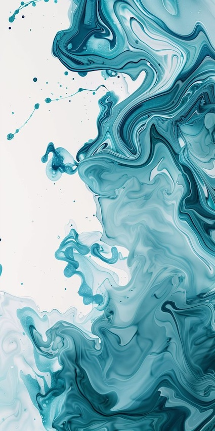
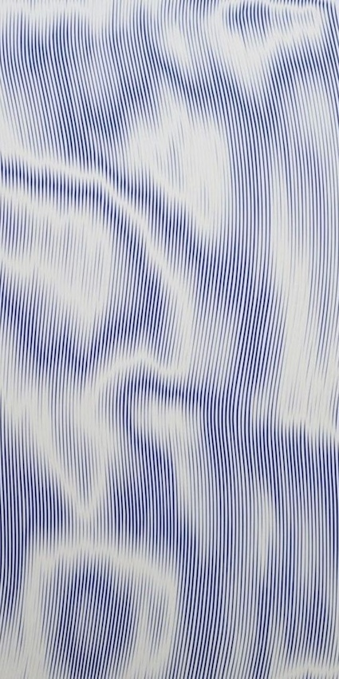
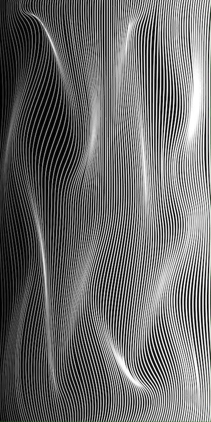
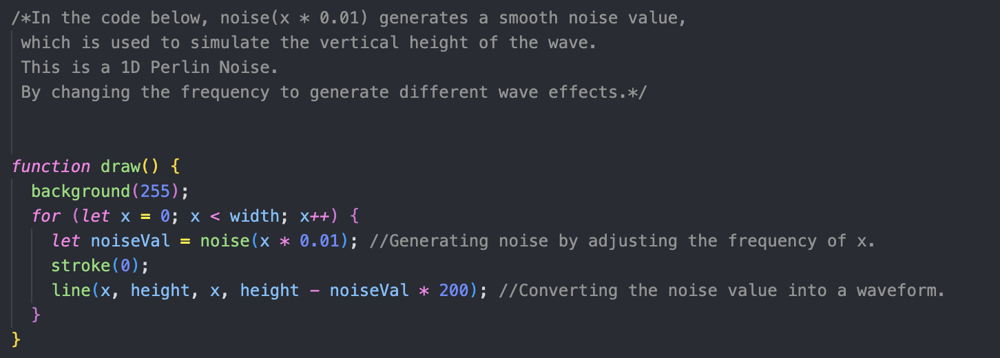
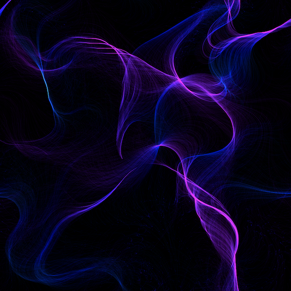
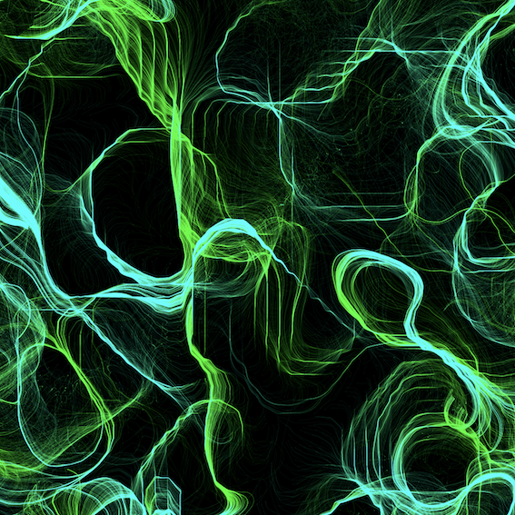
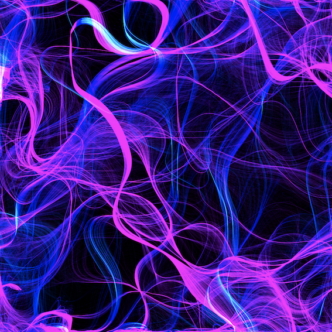
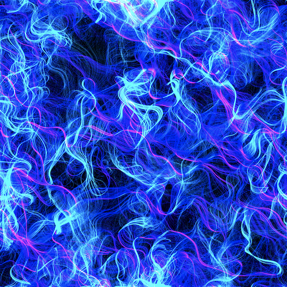

# Quiz-8
###  _About Major Assessment_

# **Part 1: Imaging Technique Inspiration**
  In this research phase, I was inspired by images of stacked curves, which create a rhythmic, flowing visual effect. These lines, based on their density and arrangement, add visual depth and convey spatial fluidity. This technique can represent the natural flow of waves, evoking the dynamic effect of water surfaces. I aim to incorporate this into my major project to present works related to water landscapes or scenes with natural elements. It introduces rich visual variation and spatial depth, offering potential for dynamic flow and interactivity.

["_Abstract Aqua Swirls_"](https://au.pinterest.com/pin/2603712280382639/)
["_Geometric Schemes_"](https://www.formagramma.com/art/15188/selected-works-johnny-abrahams/)
["_Flowing Dimensions_"](https://au.pinterest.com/pin/3025924743241731/)  

# **Part 2: Coding Technique Exploration**

 To achieve the wave effect from Part 1, **_Perlin Noise_** can be used as the primary coding technique. From my research, I found that this technique provides smooth transitions in space or time, ensuring no large jumps between adjacent pixels or points. It is _pseudo-random_, meaning it appears random but is algorithmically generated, making it useful for creating repeatable textures or patterns. By adjusting the noise function's frequency and amplitude, it generates layered waveforms with smooth transitions. This technique helps create smooth, natural waveforms, ensuring the lines have continuity and fluidity, aligning with the desired visual effect from Part 1.

["_**Order in Chaos**_"](https://codepen.io/Tibixx/pen/ExOJgKP)  

> _ChatGPT provided the Perlin Noise coding technique in this quiz, helping me better search for methods that support the imaging technique._